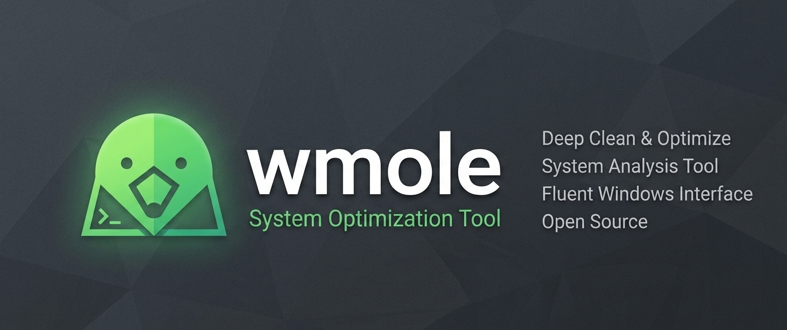

<p align="center">
  
</p>

# wmole

### 🌐 [wmole.vercel.app](https://wmole.vercel.app)

Windows-first port of [tw93/Mole](https://github.com/tw93/Mole): a terminal maintenance toolkit for cleanup, artifact purge, uninstall leftovers, optimize actions, and live system status.

[Website](https://wmole.vercel.app) · [Docs](#table-of-contents) · [Upstream Mole](https://github.com/tw93/Mole)


## Table of Contents

1. [Features](#features)
2. [Command Set](#command-set)
3. [Analyze Explorer](#analyze-explorer)
4. [Safety Model](#safety-model)
5. [What Gets Scanned](#what-gets-scanned)
6. [Configuration](#configuration)
7. [Getting Started](#getting-started)
8. [Usage Examples](#usage-examples)
9. [Icon Pack](#icon-pack)
10. [Status and Telemetry](#status-and-telemetry)
11. [Optimize Actions](#optimize-actions)
12. [Uninstall and Leftovers](#uninstall-and-leftovers)
13. [Command Input And Context Keys](#command-input-and-context-keys)
14. [Testing](#testing)
15. [Roadmap](#roadmap)

## Features

- Path-based Analyze TUI explorer with folder navigation, large-files view, and drive picker.
- Safe cleanup defaults with recycle-bin first, blocked protected paths, denylist, whitelist, and operation logs.
- Purge mode for developer artifacts (`node_modules`, `.venv`, `target`, `dist`, `.next`, and more).
- Installer mode for old setup files.
- Smart uninstall helper with fuzzy leftover detection (filesystem + registry key candidates).
- Optimize mode with dry-run support, admin/high-risk labeling, and high-risk confirmation.
- Rich status dashboard and JSON status output with device/power/uptime/network/disk stats.
- Persistent `/` command input for operation-first TUI navigation.

## Command Set

| Command | Purpose |
|---|---|
| `wmole analyze [path]` | Interactive filesystem explorer (TUI). |
| `wmole analyze [path] --json` | Path analysis as JSON (entries + large files). |
| `wmole clean [path] [--whitelist FILE]` | Safe cleanup scan and delete flow. |
| `wmole purge [path] [--paths "..."]` | Dev artifact purge candidates. |
| `wmole installer [path]` / `wmole installers [path]` | Old installer candidates. |
| `wmole uninstall` | Installed apps TUI with uninstall + leftovers. |
| `wmole uninstall --json --query X --limit N --leftovers` | Filtered uninstall report and leftovers. |
| `wmole optimize [--dry-run] [--json]` | System maintenance actions. |
| `wmole status` / `wmole status --json` | Live status or machine-readable metrics. |
| `wmole update [--json]` | Pull (if git) + dependency refresh. |
| `wmole remove [--dry-run] [--json]` | Remove local wmole state under `~/.wmole`. |
| `wmole completion --shell powershell [--install]` | Print/install PowerShell completion script. |

## Analyze Explorer

`analyze` opens a real path explorer, not only category cleanup.

- `Enter`: open folder or file location.
- `G`: show large files under current path.
- `V`: open drive picker (including external drives).
- `O`: open current item in Explorer.
- `D`: delete selected items with safety rules.

## Safety Model

- Default delete mode is recycle-bin (`send2trash`).
- Permanent delete requires explicitly enabling permanent mode with `K` in TUI.
- `--dry-run` supported for destructive CLI flows.
- Protected paths blocked, including:
  - drive roots
  - `C:\Windows`, `Program Files*`, `ProgramData`
  - user profile root
  - paths that contain `.git`
  - entries in `~/.wmole/denylist.txt`
- Whitelist exceptions from `~/.wmole/whitelist.txt`.
- Operation log at `~/.wmole/logs/operations.log`.

## What Gets Scanned

- Package caches: npm, pip, Yarn, pnpm, Cargo, Gradle, Maven, NuGet, Go build, Conda.
- Browser caches: Chrome, Edge, Firefox, Brave, Opera, Vivaldi.
- App caches: Discord, Slack, Teams, Spotify, Adobe media cache, Microsoft Store cache.
- Dev/tool caches: JetBrains, VS Code storage/cache, Puppeteer, Playwright, Docker Desktop (controlled scope), Electron.
- System targets: temp dirs, thumbnail/icon cache, DirectX shader cache, WER, Delivery Optimization, Recycle Bin, WSL logs (conservative).
- Purge artifacts: `node_modules`, `.venv`, `venv`, `__pycache__`, `.pytest_cache`, `.mypy_cache`, `.ruff_cache`, `.tox`, `target`, `build`, `dist`, `out`, `.next`, `.nuxt`, `.turbo`, `.parcel-cache`, `.angular`, `.gradle`, `.idea`, `.vs`, `obj`.

## Configuration

Auto-created on first run:

- `~/.wmole/config.json`
- `~/.wmole/purge_paths.txt`
- `~/.wmole/whitelist.txt`
- `~/.wmole/denylist.txt`

Useful knobs:

- `config.json`: `large_file_min_mb`, `analyze_start_path`, protected defaults.
- `purge_paths.txt`: default purge roots.
- `--paths "C:\src;D:\repos"`: per-run path override for purge/clean.
- `--whitelist C:\path\whitelist.txt`: per-run whitelist override for clean.

## Getting Started

```cmd
cd C:\Users\umuti\Projects\wmole
py -m pip install -r requirements.txt
run.bat
```

## Usage Examples

```cmd
py mole.py analyze C:\Users\%USERNAME%\Downloads
py mole.py analyze C:\Users\%USERNAME%\Downloads --json

py mole.py clean --dry-run
py mole.py clean C:\Users\%USERNAME%\Downloads --whitelist C:\path\wl.txt --json

py mole.py purge --paths "C:\src;D:\repos" --json
py mole.py installer C:\Users\%USERNAME%\Downloads --json

py mole.py optimize --dry-run --json
py mole.py uninstall --json --query zoom --limit 20 --leftovers

py mole.py status --json
py mole.py completion --shell powershell --install
```

## Icon Pack

Application icon assets are under:

- `assets/branding/wmole-logo.svg` (source)
- `assets/branding/wmole-logo-1024.png` (raster source)
- `assets/icons/desktop/` (`wmole.ico`, `wmole.icns`, Linux hicolor set, tray icons)
- `assets/icons/web/` (favicon + PWA icons)

Regenerate with the `web-asset-generator` skill scripts:

```cmd
py C:\Users\umuti\.codex\skills\web-asset-generator\scripts\rasterize_svg.py assets/branding/wmole-logo.svg -o assets/branding/wmole-logo-1024.png -s 1024
py C:\Users\umuti\.codex\skills\web-asset-generator\scripts\generate_desktop_icons.py assets/branding/wmole-logo-1024.png -o assets/icons/desktop --name wmole --targets all
set PYTHONUTF8=1 && py C:\Users\umuti\.codex\skills\web-asset-generator\scripts\generate_favicons.py assets/branding/wmole-logo-1024.png assets/icons/web all
```

## Status and Telemetry

`status --json` includes:

- CPU/memory/disk usage
- disk and network byte counters
- uptime
- battery/power state (if available)
- Windows/device identity
- optional temperature sensor values (if provider is available)

## Optimize Actions

Current optimize set includes DNS/Winsock/IP/ARP, event log cleanup, prefetch cleanup, Windows Update reset flow, Store cache reset, Storage Sense, and Disk Cleanup.

- `--dry-run` supported.
- High-risk actions require explicit second confirmation in TUI.
- Windows Update reset attempts to restore `wuauserv` running state after cleanup.

## Uninstall and Leftovers

Uninstall inventory includes:

- `DisplayName`
- `Publisher`
- `InstallLocation`
- `DisplayIcon`
- `EstimatedSize`
- `UninstallString` and uninstall registry key path

Leftover candidates are shown automatically after uninstall launch and can also be queried via JSON (`--leftovers`).

## Command Input And Context Keys

```text
Type / in the visible input line, filter with text, choose with Up/Down, and run with Enter.
Operations: /analyze | /categories | /purge | /installers | /uninstall
            /optimize | /status | /ports | /update | /help
Context keys: Up/Down move | Enter open/run | Space pick | D delete | K permanent mode
              R refresh | O open in Explorer | L scan uninstall leftovers
              G large files | V drives | Esc/Q back
```

## Testing

```cmd
py -m py_compile mole.py
py -m unittest discover -s tests
```

## Roadmap

- Expand leftover matching precision and confidence scoring.
- Add optional deeper Docker/WSL cleanup profiles.
- Improve completion setup UX across shells.
